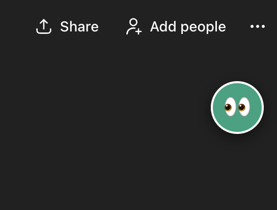

# AI SEO Peeper 👀

**AI SEO Peeper** is a lightweight Chrome Extension for SEOs, marketers, and content creators. It reveals the hidden "fan-out queries" that ChatGPT uses when it browses the web to answer a prompt.

## 🧐 What does it do?
When you ask ChatGPT a question that requires real-time data (e.g., *"Best pizza in Chicago"*), it doesn't just run one search. It often "fans out" multiple specific search queries to Bing to gather information.

Normally, these queries are hidden. **AI SEO Peeper** intercepts them in real-time and displays them in a clean, non-intrusive UI.

* **🕵️‍♂️ Reveal Hidden Intent:** See exactly what keywords the AI uses to find answers.
* **⚡ Real-Time Stream:** Queries appear instantly as ChatGPT "thinks."
* **📋 One-Click Copy:** Easily grab the full list of queries for your keyword research.
* **🫣 Minimized Mode:** Tucks away into a subtle "Eye" icon when you don't need it.

## 🚀 How to Install
Since this is a developer tool, you can install it directly from the source code:

1.  **Download:** Click the green **Code** button above -> **Download ZIP**.
2.  **Unzip:** Extract the folder to a safe place on your computer.
3.  **Open Chrome Extensions:** Go to `chrome://extensions/` in your browser.
4.  **Enable Developer Mode:** Toggle the switch in the top right corner.
5.  **Load Unpacked:** Click the button on the top left and select the folder you just unzipped.

## 🛠️ How to Use
1.  **Refresh ChatGPT:** After installing, refresh your ChatGPT tab.
2.  **Prompt:** Ask a question that requires browsing.
    * *Example:* "What are the current odds for the Super Bowl?"
    * *Example:* "Find me the top 3 SEO agencies in Austin."
3.  **Watch:** The Peeper box will appear in the top right corner with the search terms.
4.  **Analyze:** Use these terms to optimize your own content (GEO - Generative Engine Optimization).

## 🔒 Privacy
* **Local Execution:** This extension runs 100% locally on your machine.
* **No Tracking:** No data is sent to any external servers.
* **Source Code:** You are viewing the full source code right here on GitHub.

---

## ⚠️ Disclaimer
* **Not Affiliated:** This project is an independent open-source tool and is not affiliated, associated, authorized, endorsed by, or in any way officially connected with OpenAI or ChatGPT.
* **Stability:** This extension relies on specific internal API structures of the ChatGPT web application. Since OpenAI frequently updates their platform, this extension may break at any time without warning.

---
*Created by Sam @ Thencan*